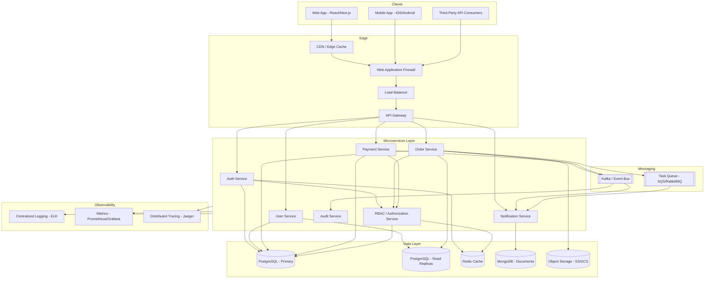
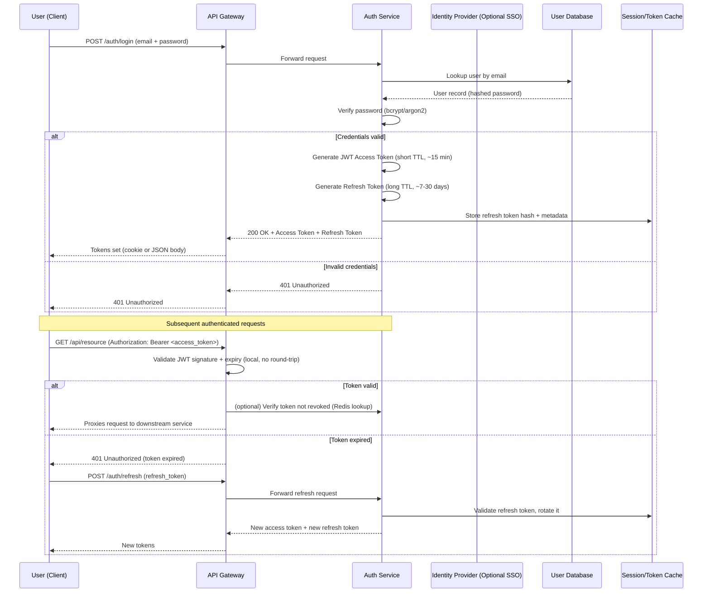
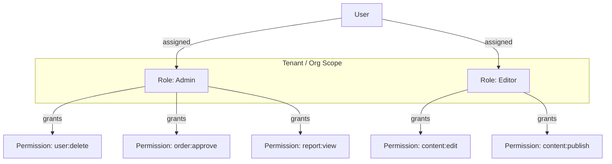
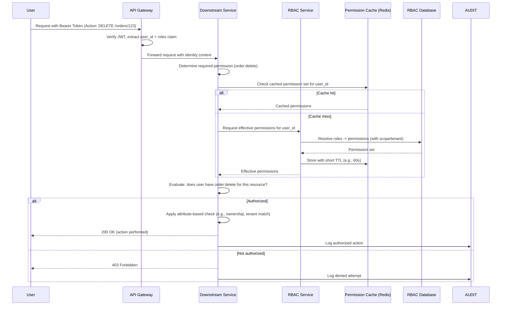
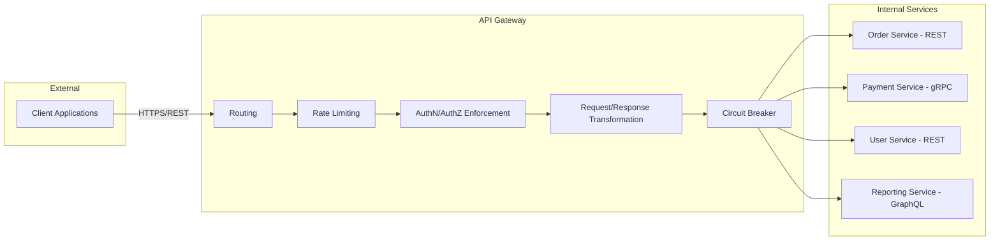
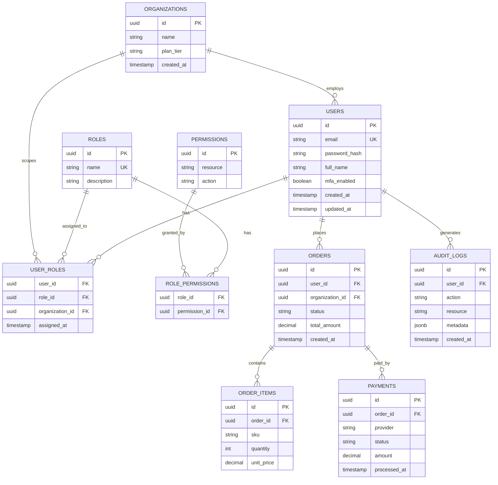
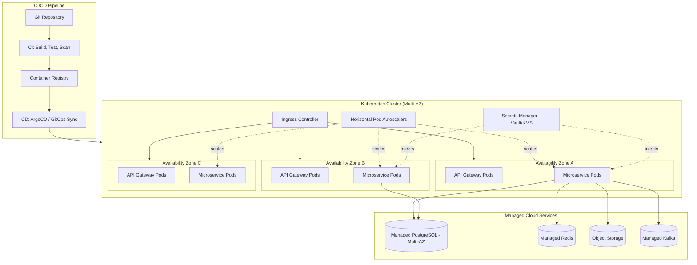

# Enterprise Architecture Documentation

## Table of Contents
1. [Overview](#overview)
2. [System Architecture Diagram](#system-architecture-diagram)
3. [Authentication Flow](#authentication-flow)
4. [RBAC Flow](#rbac-role-based-access-control-flow)
5. [API Architecture](#api-architecture)
6. [Database Design](#database-design)
7. [Deployment Architecture](#deployment-architecture)
8. [Appendix: Technology Stack](#appendix-technology-stack)

---

## Overview

This document describes the end-to-end architecture of a modern, cloud-native
enterprise platform. The system is designed around microservices principles,
a centralized API Gateway, stateless authentication using JSON Web Tokens
(JWT), fine-grained Role-Based Access Control (RBAC), a polyglot-persistence
database layer, and a container-orchestrated deployment pipeline built on
Kubernetes.

The architecture prioritizes six qualities:

- **Scalability** — independent services scale horizontally based on load.
- **Security** — authentication, authorization, and encryption are enforced
  at every boundary.
- **Resilience** — no single point of failure; graceful degradation under
  partial outages.
- **Maintainability** — services are independently deployable and owned by
  small teams.
- **Observability** — centralized logging, metrics, and distributed tracing.
- **Auditability** — every privileged action is logged for compliance.

The remainder of this document walks through the system diagram, the
authentication flow, the RBAC model, the API architecture, the database
design, and finally the deployment topology.

---

## System Architecture Diagram

At the highest level, the platform is composed of six layers: the client
layer, the edge/gateway layer, the application (microservices) layer, the
data layer, the messaging/eventing layer, and the observability layer.



### Layer Descriptions

**Client Layer.** Consumers of the system include the primary web
application (a single-page application), native mobile clients, and
external third-party integrators consuming the public API. All clients
communicate exclusively over HTTPS.

**Edge Layer.** Traffic first hits a CDN for static asset caching and
DDoS absorption, then a Web Application Firewall that filters malicious
payloads (SQL injection, XSS, known bot signatures), then a load balancer
that distributes traffic across gateway instances, and finally the API
Gateway itself, which performs routing, rate limiting, request validation,
and TLS termination.

**Application Layer.** Each microservice owns a single bounded context
(Auth, User, RBAC, Order, Payment, Notification, Audit). Services
communicate synchronously via REST/gRPC for request/response interactions
and asynchronously via Kafka for event-driven workflows. Every service is
independently deployable, versioned, and horizontally scalable.

**Data Layer.** PostgreSQL serves as the system of record for
transactional data, with read replicas offloading reporting and read-heavy
traffic. Redis provides a low-latency cache for sessions, permission
lookups, and rate-limit counters. MongoDB stores semi-structured
notification templates and logs. Object storage holds large binary assets
such as invoices, exports, and user uploads.

**Messaging Layer.** Kafka is the backbone for domain events (order
placed, payment captured, user role changed), enabling loose coupling and
event sourcing for audit trails. A secondary task queue handles simple
fire-and-forget jobs such as sending emails.

**Observability Layer.** All services emit structured logs to a
centralized ELK stack, metrics to Prometheus (visualized in Grafana), and
distributed traces to Jaeger, enabling root-cause analysis across service
boundaries.

---

## Authentication Flow

Authentication establishes *who* the caller is. The platform uses OAuth
2.0 / OpenID Connect semantics with short-lived JWT access tokens and
longer-lived, rotating refresh tokens stored securely (HTTP-only, Secure,
SameSite cookies for web; secure keychain storage for mobile).



### Key Design Decisions

**Stateless access tokens.** JWTs are signed (RS256) by the Auth Service
using a private key; the API Gateway and downstream services verify the
signature using the corresponding public key, avoiding a network call to
the Auth Service on every request. This keeps request latency low while
preserving cryptographic integrity.

**Short-lived access, rotating refresh.** Access tokens expire quickly
(typically 15 minutes) to limit the blast radius of a leaked token.
Refresh tokens are longer-lived but rotated on every use — the old
refresh token is invalidated the moment a new one is issued, which
detects token replay/theft (if an old, already-rotated refresh token is
presented again, the system revokes the entire token family and forces
re-authentication).

**Password storage.** Passwords are never stored in plaintext; they are
hashed with a memory-hard algorithm (argon2id preferred, bcrypt as
fallback) with a per-user salt and a global pepper stored in a secrets
manager.

**Multi-Factor Authentication (MFA).** After primary credential
validation, users with MFA enabled are challenged with a TOTP code or a
push notification via an authenticator app before tokens are issued.

**Single Sign-On (SSO).** For enterprise customers, the Auth Service can
delegate the credential-verification step to an external Identity
Provider (Okta, Azure AD, Google Workspace) via SAML or OIDC, after which
the platform still issues its own internal JWT so downstream services
remain provider-agnostic.

**Token revocation.** Because JWTs are stateless, immediate revocation
(e.g., on logout or account compromise) is handled via a short-TTL
denylist in Redis keyed by token ID (`jti`), checked only for
sensitive operations, keeping the fast path stateless while still
supporting revocation where it matters.

**Transport security.** All authentication traffic is over TLS 1.2+.
Tokens are never placed in URLs (to avoid leaking via logs/referrers) and
are transmitted via the `Authorization` header or secure cookies.

---

## RBAC (Role-Based Access Control) Flow

Authorization determines *what* an authenticated identity is allowed to
do. The platform implements a hierarchical RBAC model with support for
resource-level and attribute-based overrides where needed (a hybrid
RBAC/ABAC approach).

### Core Model

- **User** — an authenticated identity.
- **Role** — a named collection of permissions (e.g., `Admin`, `Manager`,
  `Editor`, `Viewer`).
- **Permission** — a fine-grained capability, expressed as
  `resource:action` (e.g., `order:read`, `order:approve`,
  `user:delete`).
- **Role Assignment** — a mapping of a user to one or more roles,
  optionally scoped to a tenant/organization/team.
- **Policy** — an optional attribute-based rule layered on top of RBAC
  for contextual decisions (e.g., "Managers can approve orders only for
  their own department").



### Authorization Decision Flow



### Key Design Decisions

**Roles embedded in the JWT (coarse-grained), resolved fully at the
service (fine-grained).** The JWT carries a lightweight `roles` claim so
the gateway can perform coarse checks (e.g., reject unauthenticated
requests to admin routes) without a database call. For fine-grained,
resource-scoped decisions, the owning microservice consults the RBAC
Service (with caching) to get the full, current permission set — this
avoids the problem of stale permissions baked into a long-lived token if
a role is revoked mid-session.

**Least privilege by default.** New users receive a minimal default role
(`Viewer`) and must be explicitly elevated. Permission checks default-deny:
absence of an explicit grant is treated as "forbidden," never "allowed."

**Tenant/organization scoping.** In a multi-tenant deployment, role
assignments are scoped to a tenant ID, so a user who is `Admin` in
Organization A has no implicit privileges in Organization B.

**Separation of duties.** Certain sensitive role combinations (e.g., a
user who can both create and approve payments) are flagged or disallowed
by policy to reduce fraud risk.

**Attribute-based overlay (ABAC).** Beyond static roles, the RBAC Service
supports contextual policies — e.g., "a Manager may approve an order only
if `order.department == user.department`" — evaluated after the base
RBAC check passes, giving fine control without exploding the number of
distinct roles.

**Caching with short TTL.** Because permission checks happen on nearly
every request, the RBAC Service's decisions are cached in Redis with a
short TTL (typically 30–60 seconds) to balance performance against
freshness — ensuring a revoked role takes effect quickly without
requiring a database round-trip on every single call.

**Full audit trail.** Every authorization decision — allowed or denied —
for a sensitive action is written asynchronously to the Audit Service via
Kafka, supporting compliance requirements such as SOC 2 and ISO 27001.

---

## API Architecture

The platform exposes a single, consistent external API surface via the
API Gateway, while internally the microservices may communicate using a
mix of protocols optimized for their specific needs.



### API Style and Standards

**External API: REST + GraphQL.** The primary public-facing API is REST,
following resource-oriented URL conventions
(`/api/v1/orders/{id}`), standard HTTP verbs, and standard status codes.
A supplementary GraphQL endpoint is offered for reporting and dashboard
use cases where clients need to compose flexible, nested queries without
over- or under-fetching.

**Internal API: gRPC where latency matters.** Service-to-service calls
that are latency-sensitive (e.g., Order Service calling Payment Service
synchronously during checkout) use gRPC with Protocol Buffers for
compact, strongly-typed, low-overhead communication. Less latency-sensitive
internal calls use REST for simplicity and easier debugging.

**Versioning.** The API is versioned in the URL path (`/api/v1/...`).
Breaking changes are only introduced in a new major version; the previous
version is supported for a defined deprecation window (typically 6–12
months) with deprecation headers surfaced in responses.

**Idempotency.** State-changing endpoints (POST/PUT/PATCH) that may be
retried by clients accept an `Idempotency-Key` header; the gateway or
service deduplicates requests bearing a previously seen key, returning
the original response instead of reprocessing.

**Rate limiting and quotas.** The gateway enforces per-client and
per-endpoint rate limits using a token-bucket algorithm backed by Redis,
protecting downstream services from abuse and noisy-neighbor effects in a
multi-tenant environment.

**Circuit breaking and retries.** Each downstream call from the gateway
is wrapped in a circuit breaker; if a service's error rate exceeds a
threshold, the breaker trips and fails fast, preventing cascading
failures, with automatic half-open probes to detect recovery.

**Pagination, filtering, and sorting.** List endpoints use cursor-based
pagination (preferred over offset-based for large, frequently mutated
datasets) along with consistent query parameters for filtering
(`?status=active`) and sorting (`?sort=-created_at`).

**Error format.** All errors follow a consistent JSON envelope:

```json
{
  "error": {
    "code": "ORDER_NOT_FOUND",
    "message": "Order with id 123 was not found.",
    "request_id": "req_9f3a...",
    "details": []
  }
}
```

**API Gateway responsibilities summary:** TLS termination, routing,
authentication enforcement, coarse authorization, rate limiting, request
validation against OpenAPI schemas, response caching for cacheable GET
endpoints, request/response logging, and protocol translation (e.g.,
REST-in / gRPC-out to an internal service).

**Service mesh (internal).** Within the Kubernetes cluster, a service
mesh (e.g., Istio or Linkerd) handles mutual TLS between services,
fine-grained internal traffic routing, retries, and telemetry collection,
complementing the edge-level API Gateway.

---

## Database Design

The platform follows a polyglot persistence strategy: the right storage
engine is chosen per workload rather than forcing every service to share
a single database.



### Design Principles

**Database-per-service (with pragmatic exceptions).** Each microservice
owns its own schema/database to preserve service autonomy and avoid
tight coupling through shared tables. In this design, Auth, User, RBAC,
Order, and Payment share a single PostgreSQL cluster but use distinct
schemas for operational simplicity, while Notification data (templates,
delivery logs) lives in MongoDB due to its flexible, semi-structured
shape.

**Normalization for transactional data.** Core transactional entities
(users, orders, payments, roles, permissions) are stored in a normalized
relational model (3NF) in PostgreSQL to guarantee ACID consistency for
financial and identity data — this is non-negotiable for correctness in
billing and access control.

**Read replicas for scale.** PostgreSQL read replicas serve read-heavy
traffic such as reporting dashboards and analytics queries, keeping load
off the primary write node. Services route read-only queries to
replicas via a read/write-splitting proxy (e.g., PgBouncer + a routing
layer).

**Caching layer.** Redis caches three categories of data: (1) session
and token metadata for authentication, (2) resolved RBAC permission sets
for authorization, and (3) hot read paths such as product catalogs or
user profile summaries, each with an appropriate TTL and explicit
invalidation on writes.

**Document store for flexible schemas.** MongoDB stores content that
does not fit a rigid relational shape well — notification templates,
webhook payloads, and unstructured event metadata — where schema
flexibility outweighs the need for joins.

**Object storage for large binaries.** Invoices, exported reports, and
user-uploaded files are stored in S3-compatible object storage, with only
a reference URL/key persisted in the relational database, keeping the
database lean and backup/restore fast.

**Auditing via append-only log.** The `AUDIT_LOGS` table (and its
corresponding Kafka topic) is append-only; records are never updated or
deleted, satisfying compliance requirements for tamper-evident history.
For very high-volume audit data, older records are periodically archived
to cold object storage.

**Multi-tenancy strategy.** Tenant isolation is enforced at the row level
via an `organization_id` foreign key present on all tenant-scoped tables,
combined with PostgreSQL Row-Level Security (RLS) policies that prevent
cross-tenant data leakage even in the event of an application-layer bug.

**Indexing strategy.** Foreign keys and frequently filtered/sorted
columns (`status`, `created_at`, `organization_id`) are indexed;
composite indexes support common query patterns (e.g.,
`(organization_id, status, created_at)` for order listing screens).
Query plans are periodically reviewed via `EXPLAIN ANALYZE` as part of
performance testing.

**Backup and disaster recovery.** PostgreSQL uses continuous
write-ahead-log (WAL) archiving plus nightly full snapshots, enabling
point-in-time recovery. Backups are encrypted at rest and periodically
tested via restore drills. Recovery Point Objective (RPO) is targeted at
under 5 minutes; Recovery Time Objective (RTO) under 1 hour.

---

## Deployment Architecture

The platform is deployed on Kubernetes across multiple availability zones
within a cloud provider (AWS/GCP/Azure), using GitOps for continuous
delivery.



### Deployment Practices

**Multi-AZ, multi-replica by default.** Every service is deployed with a
minimum of three replicas spread across at least three availability
zones, so the loss of a single zone does not take the platform offline.
Kubernetes anti-affinity rules prevent multiple replicas of the same
service from co-locating on a single node.

**GitOps-based continuous delivery.** All Kubernetes manifests (or Helm
charts) are stored in a Git repository as the single source of truth. A
GitOps controller (e.g., ArgoCD) continuously reconciles the live cluster
state to match Git, so deployments are declarative, auditable, and easily
rolled back via a `git revert`.

**CI pipeline stages.** On every merge to the main branch: (1) unit and
integration tests run, (2) static analysis and dependency vulnerability
scanning run (SAST + software composition analysis), (3) a container
image is built and scanned for known CVEs, (4) the image is pushed to a
private container registry, and (5) the GitOps controller detects the new
image tag and rolls it out.

**Progressive delivery.** New versions are rolled out using canary or
blue-green strategies — an initial 5% of traffic is shifted to the new
version, key error-rate and latency metrics are automatically monitored,
and the rollout either proceeds automatically or is rolled back if
thresholds are breached, minimizing blast radius of bad deploys.

**Autoscaling.** Horizontal Pod Autoscalers scale each service based on
CPU, memory, and custom metrics (e.g., request queue depth). Cluster
Autoscaler adds or removes worker nodes based on aggregate pod scheduling
pressure, and workloads with predictable spikes (e.g., month-end billing)
can pre-scale via scheduled scaling policies.

**Secrets management.** No secret (database credentials, JWT signing
keys, third-party API keys) is stored in Git or container images. Secrets
are managed by a dedicated secrets manager (HashiCorp Vault or a cloud
KMS) and injected into pods at runtime via a sidecar or CSI driver, with
automatic rotation on a defined schedule.

**Network segmentation.** Kubernetes NetworkPolicies restrict which
services may talk to which — for example, only the Payment Service may
reach the Payment Database, and only the API Gateway may be reached
directly from the public internet via the Ingress Controller.

**Managed data services.** Stateful dependencies (PostgreSQL, Redis,
Kafka) are run as managed cloud services rather than self-hosted in the
cluster, offloading operational burden (patching, backups, failover) to
the cloud provider and improving reliability.

**Environment separation.** Distinct clusters (or namespaces with strict
isolation) exist for `dev`, `staging`, and `production`, with production
requiring manual approval gates for high-risk changes and stricter
resource quotas and network policies.

**Disaster recovery / multi-region.** For critical workloads, a
warm-standby deployment exists in a secondary region; database
replication is asynchronous to the standby region, and DNS-based failover
(via health-checked routing) can redirect traffic within minutes of a
regional outage.

**Observability in production.** Every pod exports Prometheus metrics
scraped on a 15-second interval; logs are shipped via a log-forwarding
daemonset to the centralized ELK stack; distributed traces are sampled
and forwarded to Jaeger, giving on-call engineers a single pane of glass
to diagnose incidents across the entire request path, from the edge
gateway down to the database.

---

## Appendix: Technology Stack

| Layer | Technology Choices |
|---|---|
| Frontend | React / Next.js, TypeScript |
| Mobile | Swift (iOS), Kotlin (Android) |
| API Gateway | Kong / AWS API Gateway / Envoy |
| Microservices | Node.js / Go / Java (Spring Boot) |
| Service Mesh | Istio / Linkerd |
| Auth | OAuth 2.0, OpenID Connect, JWT (RS256) |
| Relational DB | PostgreSQL (managed, Multi-AZ) |
| Cache | Redis (managed) |
| Document Store | MongoDB |
| Object Storage | Amazon S3 / GCS |
| Messaging | Apache Kafka (managed - MSK/Confluent) |
| Task Queue | RabbitMQ / Amazon SQS |
| Orchestration | Kubernetes (EKS/GKE/AKS) |
| CI/CD | GitHub Actions + ArgoCD (GitOps) |
| Secrets | HashiCorp Vault / Cloud KMS |
| Logging | ELK Stack (Elasticsearch, Logstash, Kibana) |
| Metrics | Prometheus + Grafana |
| Tracing | Jaeger / OpenTelemetry |
| IaC | Terraform |

---

*Document version: 1.0 — Generated architecture reference for internal engineering use.*
